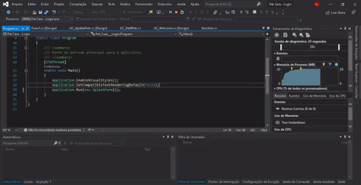

<h3 align="center">
  
</h3>


<p align="center"> 🐾 <strong>PetNotion - 3º ADS</strong> 🚧
 </p>
 
 <p align="center"> :rocket: <strong>Em Andamento...</strong> 🚧
 </p>
 
<br>

<p align="center">
   
  
  <a href="https://github.com/savio-2-lopes">
    
  </a>
 
 <a href="https://github.com/savio-2-lopes">
    
  </a>
</p>

<br> 

## :pushpin: Índice

- [Sobre](#sobre-o-projeto)
- [Layout](#layout)
- [Como Executar](#executar)
- [Tecnologias](#tecnologias)
- [Licença](#licenca)

<br>

<a id="sobre-o-projeto"></a>

## 💻 Sobre o projeto

🚀 **PetNotion** - é uma plataforma desktop, com SQL Server, focada em gerenciar o ciclo de vida do seu Pet.

<br>

```bash
# Entre no arquivo function.cs 
# Modifique o código abaixo com a conexão local do SQL Server de sua máquina
$ con.ConnectionString = "data source =DESKTOP-GJ8HRSA\\SQLEXPRESS;

```
<br>

<a id="layout"></a>

## 🎨 Layout

<p align="center"> 
  
</p>
 
<br>

<a id="executar"></a>

## 🚀 Como executar o projeto

### Pré-requisitos

Antes de começar, você vai precisar ter instalado em sua máquina as seguintes ferramentas:
[.NET CORE](https://dotnet.microsoft.com), [SQL Server](https://www.microsoft.com/pt-br/sql-server/sql-server-2019) e um editor para trabalhar tanto com o código quanto para o frontend [Visual Studio Community](https://visualstudio.microsoft.com/pt-br/vs/community/)

<br>

<a id="w"></a>

#### 🧭 Rodando a aplicação

```bash

# Clone este repositório
$ git clone https://github.com/savio-2-lopes/Pet_Notion.git

# Abra a seguinte a pasta usando o Visual Studio Community

# Execute a aplicação

# Ou apenas clicar no arquivo que o arquivo será aberto no Visual Studio Community
$ Pet Care - Login.sln

# Crie um database usando o SQL Server com nome de PetCare utilizando o código PetCare.sql

```

<br>

<a id="tecnologias"></a>

## 🛠 Tecnologias

As seguintes ferramentas foram usadas na construção do projeto:

- [.NET Framework](https://dotnet.microsoft.com/download/dotnet-framework/net472)
- [.NET](https://dotnet.microsoft.com/)
- [SQL Server](https://www.microsoft.com/pt-br/sql-server/sql-server-2019)
- [GUNA UI](https://gunaframework.com)

<br>

<a id="licenca"></a>

## :memo: Licença

Este projeto está sob a licença do MIT. Veja a [página de licença](https://opensource.org/licenses/MIT) para mais detalhes.
